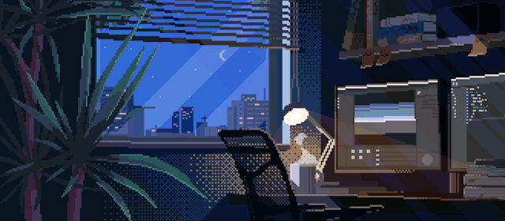

## 🖖 Hey visitor! Welcome to my Github Page 

    

### 🚀 About Me

I am a graduate of the Artificial Intelligence Department, deeply passionate about Artificial Intelligence.

Since 2021, I have been actively studying and working in the field of artificial intelligence. During this time, I have contributed to diverse projects involving machine learning, deep learning, computer vision, natural language processing, and bot programming. 

My experiences have equipped me with a strong foundation in AI and its applications, and I am always eager to learn and explore new challenges in this exciting field.

- 🌎 I'm from Taiwan
- 👨🏻‍💻 Love programming and gaming
- 🧠 Love sharing knowledge
- 🤖 Passionate about exploring the potential of AI
- 🌟 Enjoy trying new things and embracing challenges

### 💻 Tech stack

### ⭐ GitHub Stats

 
    
    

